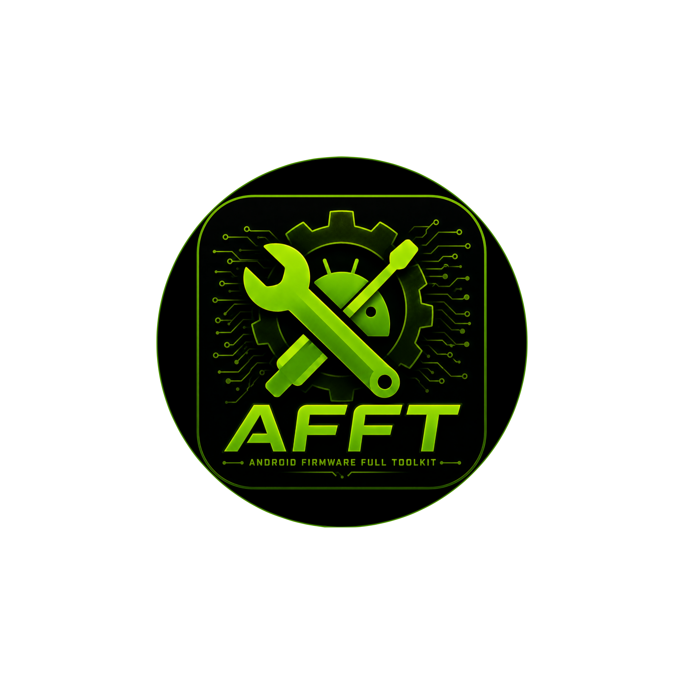
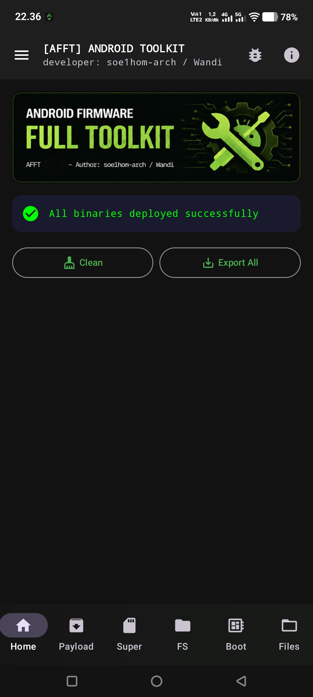
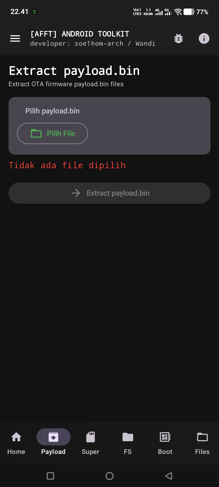
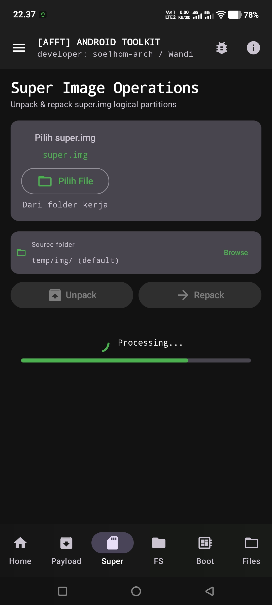
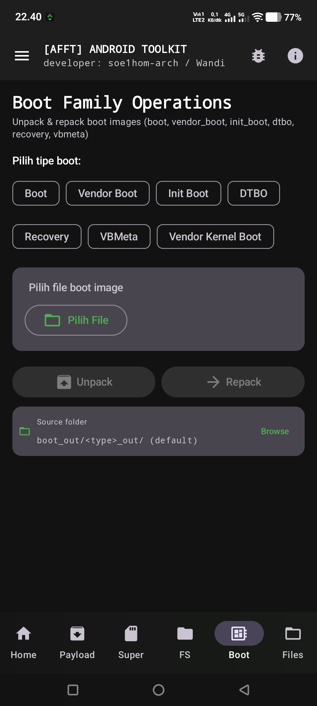
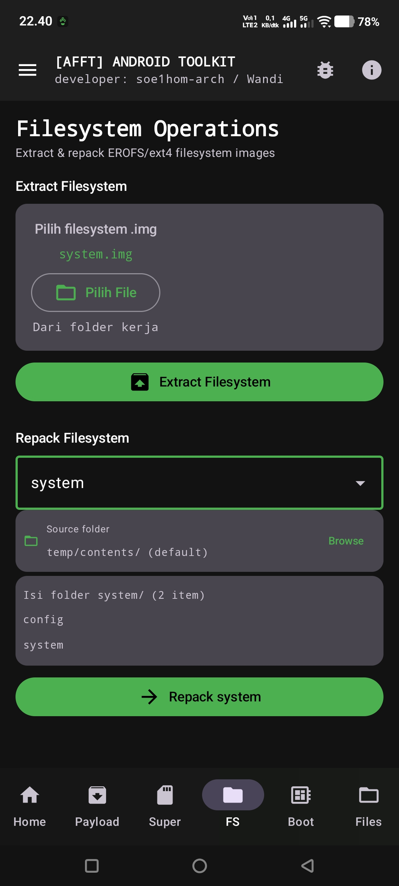
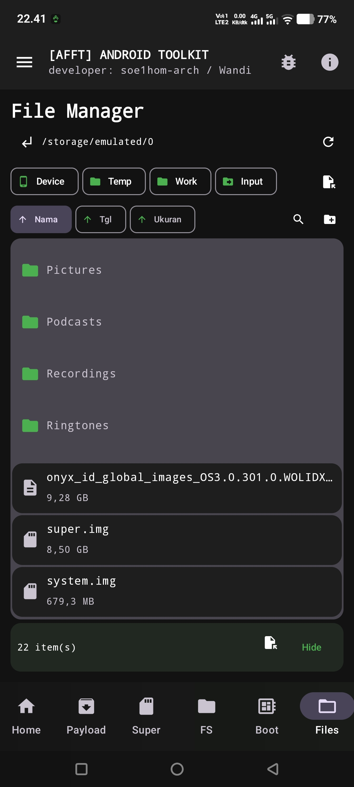
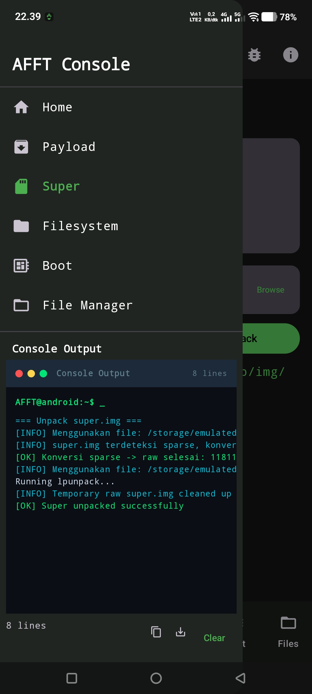

<p align="center">
  
</p>

<h1 align="center">AFFT Toolkit</h1>

<p align="center">
  <b>Android Firmware Full Toolkit</b> — analyze, unpack & repack ROM firmware directly on your Android device.<br>
  No PC required. No Termux required. Fully on-device.
</p>

<p align="center">
  <a href="https://github.com/soe1hom-arch/AFFT-Toolkit/releases/latest"></a>
  <a href="https://github.com/soe1hom-arch/AFFT-Toolkit/actions"></a>
  <a href="https://github.com/soe1hom-arch/AFFT-Toolkit/releases"></a>
  
  
  
</p>

<p align="center">
  <a href="https://soe1hom-arch.github.io/AFFT-Toolkit/">🌐 Website</a> ·
  <a href="https://github.com/soe1hom-arch/AFFT-Toolkit/releases/latest">📥 Download</a> ·
  <a href="CHANGELOG.md">📋 Changelog</a> ·
  <a href="https://github.com/soe1hom-arch/AFFT-Toolkit/discussions">💬 Discussions</a>
</p>

---

## 📥 Download

[⬇️ **Download the latest APK**](https://github.com/soe1hom-arch/AFFT-Toolkit/releases/latest)

1. Download & open the APK on your device (allow unknown sources if asked).
2. Grant **"Manage All Files"** access on first launch.
3. Choose a tool (Payload / Super / Filesystem / Boot), pick a firmware file, analyze or unpack — everything runs on-device.

> 🚀 **v2.2.0** — Workspace Engine, firmware analysis (payload/boot/super/filesystem parsers), premium UI themes, custom fonts & languages.

---

## ✨ What's New in v2.2.0

- **Workspace Engine** — every firmware task is a project: create, open, resume, rename, delete, recent projects, operation history, metadata & health score.
- **Firmware Analysis** — metadata-only parsers for `payload.bin`, `boot.img`, `super.img` and EROFS/ext4 images. Safe for 8–10+ GB images (no full-image loading), with validation, health score & recommendations.
- **Firmware Inspector** — dashboard with StatusPanel, WorkspaceCard, QuickMetrics, and a Live Status card that stays alive even while idle.
- **Premium appearance** — 6 theme presets (AFFT Green, Midnight Cyan, Amber Solar, Violet Nebula, Cherry Red, Dark Gray Premium), System/Dark/Light mode, dynamic color, custom accent & icon colors, custom fonts (Inter & JetBrains Mono).
- **Languages** — English (default) and Bahasa Indonesia, persisted.
- **Interactive metadata** — long values open a bottom sheet with copy/share/open-folder actions.
- **AFFT Manager** — full file management: search, sort, multi-select, copy/move, delete, create folder, rename, properties, import.

## ✨ What's New in v2.3.0

- **Tools Hub & Navigation** — Home is now a hub for every tool with sealed-class routes, a working Android back stack, and deep links such as `afft://tools/super`.
- **Professional UI** — consistent headers, numbered step flows and unified dialogs across all tool screens and the file manager.
- **Repack from any folder** — the repack source folder can be picked from anywhere on the device (built-in folder browser or the system SAF folder picker), not just the workspace.
- **Persistent history & resume** — extract/repack operations are recorded per project, history survives restarts (and can be cleared), and Home shows Recent Projects with a resume point to continue where you left off.
- **Service refactor** — log and storage concerns moved out of `AFFTService` (`LogManager`, `StorageManager`).

See the full history in [CHANGELOG.md](CHANGELOG.md).

---

## 🎯 Features

| Feature | Description |
|---------|-------------|
| **Payload Dumper** | Analyze & unpack `payload.bin` OTA firmware, with on-demand SHA-256 (payload-dumper-go engine). |
| **Super Image** | Unpack & repack `super.img`, sparse-aware (lpunpack/lpmake). |
| **Filesystem** | Extract & repack EROFS/ext4 images (mkfs.erofs / debugfs / make_ext4fs). |
| **Boot Family** | Unpack & repack 7 boot image types incl. `vendor_boot` (magiskboot). |
| **Firmware Analysis** | Project-based parsers for payload/boot/super/filesystem with health score, validation & recommendations. |
| **Firmware Inspector** | Dashboard: current project, analysis result, health score, validation, operation history. |
| **Workspace Projects** | Every operation belongs to a project with automatic folder structure and chronological history. |
| **Tools Hub & Navigation** | Sealed-class routes, Android back stack, and `afft://` deep links between tools. |
| **Repack Anywhere** | Pick the repack source folder from anywhere on the device (built-in browser or system SAF picker). |
| **Professional UI** | Consistent headers, numbered steps and unified dialogs across all tool screens & the file manager. |
| **Live Status** | Always-animated status card on Home and every operation screen. |
| **Interactive Metadata** | Paths, hashes, fingerprints & any long value open a bottom sheet — copy, share, open folder. |
| **Appearance** | 6 premium presets, custom accent & icon colors, dynamic color, custom fonts. |
| **Settings** | Language (EN/ID), theme, fonts and appearance in one place. |
| **Console Log** | Real-time output in the sidebar, debug mode, and log recording toggle. |
| **AFFT Manager** | Device file browser with search, sort, multi-select, copy/move/delete, create folder, rename, properties, import. |
| **About & Legal** | Developer & tech stack, third-party credits, features, and bundled licenses (Apache-2.0, OFL-1.1, third-party notice). |

---

## 📸 Preview

<table border="0" cellpadding="6" align="center">
  <tr>
    <td></td>
    <td></td>
    <td></td>
  </tr>
  <tr>
    <td></td>
    <td></td>
    <td></td>
  </tr>
  <tr align="center">
    <td colspan="3"></td>
  </tr>
</table>

---

## 🗂 Workspace Projects

Every firmware operation belongs to a **Workspace Project** so you can always resume where you left off.

```
/storage/emulated/0/Android/data/com.afft.app/files/workspace/
└── <ProjectName>/
    ├── metadata.json   ← project info (name, device, firmware type, status, health)
    ├── logs/           ← operation logs
    ├── output/         ← extracted / exported results
    ├── temp/           ← working files
    ├── cache/          ← cached data
    ├── payload/        ← payload.bin work area
    ├── boot/           ← boot images work area
    ├── super/          ← super.img work area
    ├── filesystem/     ← filesystem work area
    ├── apk/            ← APK work area
    └── reports/        ← analysis reports
```

Projects survive app restarts and configuration changes; missing folders are recreated automatically.

---

## 📋 Requirements

| | |
|---|----|
| **Android** | 8.0+ (API 26) |
| **Architecture** | ARM64 only |
| **RAM** | 4 GB minimum (6 GB+ recommended) |
| **Storage** | At least 10 GB free for large firmware files |
| **Permissions** | `MANAGE_EXTERNAL_STORAGE`, foreground service, `POST_NOTIFICATIONS` |

---

## 🔐 Privacy & Backup

AFFT Toolkit **excludes all working data from Android Auto Backup / device transfer**:

- `afft_work/` (input, temp, logs, extraction & repack results) — **excluded**
- `workspace/` (firmware projects) — **excluded**
- Deployed binaries — **excluded** (re-extracted from assets)

Rules are enforced via `res/xml/data_extraction_rules.xml` (Android 12+) and `res/xml/backup_rules.xml` (older). Firmware images are never uploaded to cloud backup.

---

## 🛠 Building from Source

```bash
# Debug APK + unit tests
./gradlew :app:assembleDebug :app:testDebugUnitTest

# Release APK (requires keystore env vars)
KEYSTORE_PATH=... KEYSTORE_PASSWORD=... KEY_ALIAS=... KEY_PASSWORD=... \
  ./gradlew :app:assembleRelease
```

> Release builds are also produced automatically by GitHub Actions whenever a `v*` tag is pushed.

---

## 🙏 Credits

| Binary | Source |
|--------|--------|
| **payload-dumper-go** | [ssut/payload-dumper-go](https://github.com/ssut/payload-dumper-go) |
| **lpmake / lpunpack** | [AOSP liblp](https://android.googlesource.com/platform/system/core/) |
| **magiskboot** | [topjohnwu/Magisk](https://github.com/topjohnwu/Magisk) |
| **simg2img** | [AOSP](https://android.googlesource.com/platform/system/core/) |
| **mkfs.erofs / extract.erofs** | [erofs-utils](https://git.kernel.org/pub/scm/linux/kernel/git/xiang/erofs-utils.git) |
| **make_ext4fs / debugfs** | [AOSP](https://android.googlesource.com/platform/system/core/) |
| **liblzma / libzstd** | [tukaani-project/xz](https://github.com/tukaani-project/xz) / [facebook/zstd](https://github.com/facebook/zstd) |
| **Inter** | [rsms/inter](https://github.com/rsms/inter) (OFL-1.1) |
| **JetBrains Mono** | [JetBrains/JetBrainsMono](https://github.com/JetBrains/JetBrainsMono) (OFL-1.1) |

---

## 👨‍💻 Developer

**Wandi / soe1hom-arch**

[Report Issue](https://github.com/soe1hom-arch/AFFT-Toolkit/issues) · [Discussions](https://github.com/soe1hom-arch/AFFT-Toolkit/discussions)

---

## 📄 License

Apache License 2.0 — © 2026 Wandi (see [NOTICE](NOTICE)). Third-party binaries are subject to their respective licenses.
